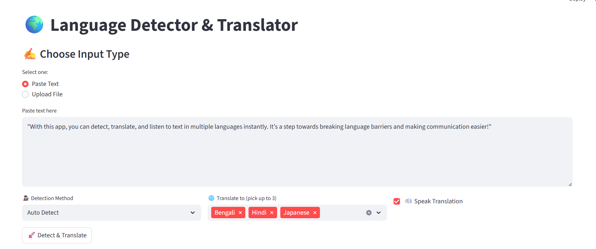
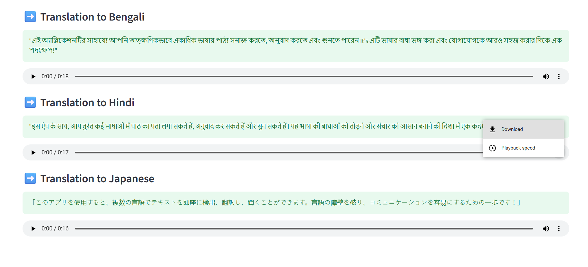

# 🌍 Language Detector & Translator

---

## **Overview**
A **web-based NLP application** built using **Python and Streamlit** to detect the language of text and translate it into multiple languages with optional **text-to-speech (TTS) audio output**. Supports **typed text** and **file uploads** (`txt`, `pdf`, `docx`).  

## 🌐 Multi-Language Detection & Translation

This project goes beyond regular language detection and translation apps by allowing users to **translate text into up to three languages at the same time**.  

The app provides **detection confidence/accuracy**, helping users see **how certain the system is about the detected language**.

---

## **APP DEMO**

---

## **Key Features**
- **Multiple Input Methods**: Paste text or upload files.  
- **Language Detection with Confidence**:  
  - Fast (`langdetect`)  
  - Robust (`langid`)  
  - Auto-detect via Google Translate  
  - **Displays confidence/accuracy scores** for detected language  
- **Multi-Language Translation**: Translate text into **up to 3 languages simultaneously**.  
- **Text-to-Speech (TTS)**: Play translated text in audio using **gTTS**.  
- **User-Friendly Interface**: Responsive layout with **real-time feedback**.  
- **Error Handling**: Handles empty inputs, unsupported files, and API issues gracefully.

---
## How to Use the App

Follow these steps to use the Language Detector & Translator:

### **1. Choose Input Type**
- **Paste Text:** Enter text directly in the text area.  
- **Upload File:** Upload `.txt`, `.pdf`, or `.docx` files.

### **2. Select Language Detection Method**
- **Auto Detect** (Google Translate)  
- **langdetect** (fast)  
- **langid** (robust)

### **3. Select Target Languages**
- Choose **up to 3 languages** for translation.  
- Default selection is **English**.

### **4. Enable Text-to-Speech (Optional)**
- Check the box to play translated text as audio.

### **5. Click “🚀 Detect & Translate”**
- The **detected language** along with **confidence score** will be displayed.  
- Translations for selected languages will appear below.  
- Audio playback (if enabled) will also be available for each translation.

## **Tech Stack**
- **Python**  
- **Streamlit** – Web interface  
- **langdetect / langid** – Language detection  
- **googletrans** – Translation API  
- **gTTS** – Text-to-speech  
- **PyPDF2 / python-docx** – File parsing  

---

## Installation & Running the App

Follow these steps to set up and run the Language Detector & Translator locally:

---

### **1️⃣ Clone the Repository**

git clone <your-repo-url>
cd <repo-folder>

### **2️⃣ Create a Virtual Environment (Recommended)**
# Windows
- python -m venv venv
- venv\Scripts\activate

# Mac/Linux
- python -m venv venv
- source venv/bin/activate

### **3️⃣ Install Required Dependencies**
- pip install -r requirements.txt
### **4️⃣ Run the Streamlit App**
- streamlit run app.py

### **5️⃣ Open the App in Browser**

- Streamlit will automatically open the app in your default browser.

### **6️⃣ Exiting the App**

- Press Ctrl + C in the terminal to stop the Streamlit server.

### **Deactivate the virtual environment if desired:**

- deactivate

